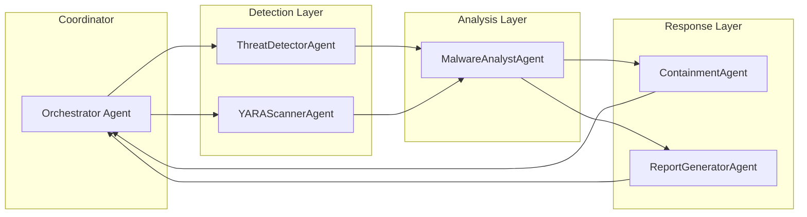

# Aegis Defensive AI Architecture

**Version:** 0.3 (YARA Integrated)  
**Date:** 2026-06-19

## High-Level Overview

```mermaid
flowchart TD
    A[Threat Intake<br/>Logs / Alerts / Agent Traces] --> B[Guardrails Layer]
    B --> C{Detection Engine}
    C -->|Keyword + Behavioural| D[YARA Scanner<br/>(optional real rules)]
    C -->|YARA Match| E[Critical Ransomware<br/>Confidence 0.95]
    C -->|Keyword Match| F[High Severity<br/>Malicious Agent]
    D --> E
    E --> G[Protective Playbook Engine]
    F --> G
    G --> H{Human-in-the-Loop<br/>Approval Gate}
    H -->|Approved| I[Containment & Response<br/>Isolate / Kill / Snapshot / Block / Report]
    H -->|Denied| J[Escalate to SOC + Log]
    I --> K[Observability & Tracing<br/>Phoenix / OpenTelemetry]
    K --> L[Feedback Loop to Detection]
```

## Component Layers

### 1. Intake & Guardrails
- Input sanitization
- Dangerous command blocking (CAI-style)
- Pre-processing for downstream agents

### 2. Detection Engine (v0.3)
- Keyword + behavioural rules
- **Optional real YARA integration** (graceful fallback)
- Confidence scoring
- Threat classification: benign / ransomware / malicious_agent

### 3. Response Playbook Engine
- Pre-defined playbooks (RANSOMWARE_CRITICAL_v1, MALICIOUS_AGENT_HIGH_v1)
- Numbered, auditable action lists
- Playbook versioning for compliance

### 4. Human-in-the-Loop Gate
- Mandatory for critical/high severity
- Designed for easy CAI HITL integration

### 5. Execution & Observability
- Sandboxed tool execution (future CAI tools)
- Full tracing and audit logging

## Multi-Agent Swarm View (Future Evolution)



**Key Agent Roles (see `examples/ransomware_response_swarm.py`):**
- **ThreatDetectorAgent**: Initial triage + YARA
- **MalwareAnalystAgent**: Deep analysis (integrates ties2 / mrphrazer tools)
- **ContainmentAgent**: Safe execution of isolation/kill/snapshot
- **Orchestrator**: Coordinates handoff, HITL, and feedback

## Technology Stack Recommendations
- **Core Framework**: aliasrobotics/CAI (ReACT + guardrails + tools)
- **YARA**: yara-python + curated ransomware rules
- **Orchestration**: CAI patterns or LangGraph (for complex swarms)
- **Observability**: Phoenix + OpenTelemetry
- **Sandboxing**: OpenClaw / brood-box style isolation

## Security Posture
- Defense-in-depth via layered guardrails
- HITL on all high/critical actions
- Full audit trail
- YARA + behavioural detection for ransomware
- Easy integration with EDR/SIEM/SOAR

**JARVIS Note:** This architecture is designed for incremental evolution from the current single-agent template to a full defensive swarm while maintaining strong guardrails and human oversight.